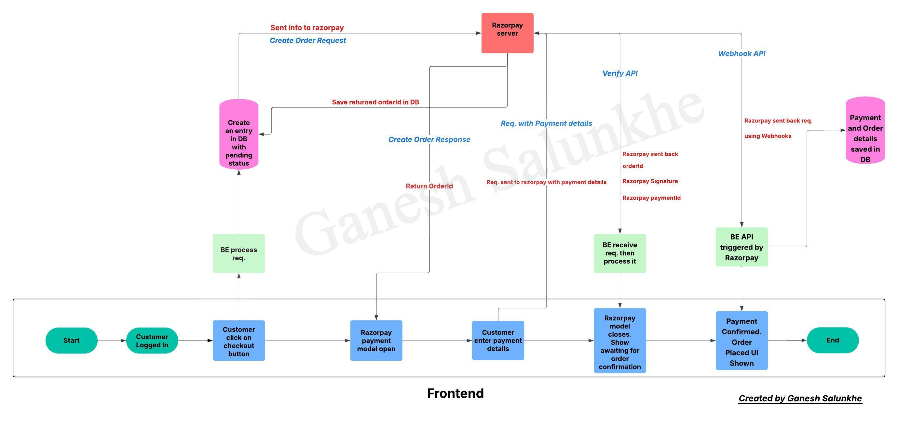

##  Mobile Shopping Application (MSA)📱

A full-stack microservices-based e-commerce platform that allows vendors and customers to interact through dedicated frontend interfaces. It supports vendor listing, product listings, customer cart/order management, secure payments.

---
## Documentation

- [Basic Functionality](docs/BasicFunctionality/basicFunctionality%20.jpg)
- [Use case diagram](docs/UseCaseDiagram/useCaseDiagram.png)
- [Database Schema](docs/DatabaseSchema/)
- [Payment Gateway](docs/PaymentGateway/PaymentGatewayArchitecture.jpeg)

---

##  Tech Stack

###  Frontend

* **Customer**: React + TailwindCSS + Zustand + React Hook Form + React Query + Axios + RazorPay Payment Gateway + AWS S3
* **Vendor**: React + TailwindCSS + React Hook Form + React Query + Axios + AWS S3
* **Build Tool**: Vite

### Backend

* **Node.js + Express.js**
* **Sequelize ORM** with MySQL
* **Multer for file upload**
* **RESTful APIs**
* **Service Pattern(MVCS)**

### Third-Party Integrations

* **AWS S3** – Image upload & storage
* **Razorpay** – Payment gateway

---

##  Features


###  Vendor Dashboard

* CRUD for product listings
* Manage orders
* Update brand logo 
* Manage profile

###  Customer Portal

* Browse products without login
* Product search and filtering
* Add/remove items in the cart
* CRUD operations on address
* Place orders (no cancellations post-placement)
* Make payments via Razorpay
* Manage profile
* Demo footer links

---

##  Project Structure

```
/MSA
├── /Frontend(Admin) 
├── /Frontend(Customer)
├── /Fronted(Vendor)
├── /backend
├── /docs
```

---


##  Getting Started

### 1. Clone the repo

```bash
git clone https://github.com/iamganeshsalunkhe/mobile-shopping-app.git
cd MSA
```

### 2. Install  backend dependencies

**For backend**
```bash
cd backend
npm install
npm start
```
### 3. Setup a MySQL database:
* Create a new MySQL database and update the database configuration in 
`
config/config.json
` 

### 4. Run database migrations

**In backend folder(MSA/backend)**  
```sh
npx sequelize db:migrate
```
### 5. Install frontend dependencies
**For Vendor**
```sh
cd Frontend(vendor)
npm run dev
```
**For Customer**
```sh
cd Frontend(customer)
npm run dev
```

---

## Database Schema

* Built clean and normalized, scalable database
* Each data entry stored neatly considered all edge cases


---

##  Authentication & Security

* JWT-based auth stored in **HTTP-only cookies**
* Role-based access controls: `vendor`, `customer`

---

##  Image Upload

* Vendor's brand logo and product images are uploaded via multer to AWS S3
* Supports **single** image upload (brand-logo) and **multiple** image uploads (products)

---

##  Payments

* Razorpay Checkout integration with Webhook implementation
* Payments locked after checkout; no cancellation
* An order gets confirmed only after the webhook reaches the backend

### Payment Gateway Architecture Diagram


---


##  Dev Tools

* Nodemon for backend dev
* ESLint + Prettier
* React-Query DevTools, Zustand Devtools, DaisyUI, mantine UI
* Postman
* VS code
* draw.io
* dbdiagram.io
---


##  License

MIT License

---

##  Contributing

Pull requests are welcome. For major changes, please open an issue first.
:)
# mobile-shopping-app-DevOps
# mobile-shopping-app-DevOps
